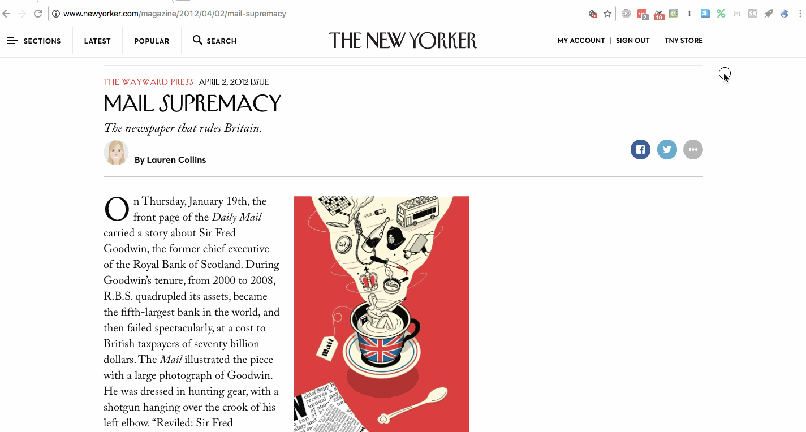

# Percent Scroll Widget

It's a Chrome extension that tracks how far down the page you've scrolled! Click on the little button, and an overlay will pop up. Click it again and it will go away. Nice.

Honestly, it nudges your reading experience a bit closer to dystopia. Why do you need to know what percentage of the way through an article you are? Are you so desperate to be done with it? Isn't it better to immerse yourself in the reading experience and learn or enjoy or appreciate or simply experience? This is your one life, after all.

But I found myself wanting this to better estimate how long school assignments would take me to read. Or just if I had time to finish other things. I usually don't use it, but sometimes it comes in handy.

Which is all to say: Be wary of this, but I hope it can be helpful to you too.

## Installation

You can install from the Chrome Web Store. As soon as I get it in there, I'll add a link.

## Questions, concerns, suggestions?

Feel free to leave an issue, I guess, or just [contact me](https://alecglassford.com). You can do pretty much whatever you want with this, per the [license](LICENSE.txt).
